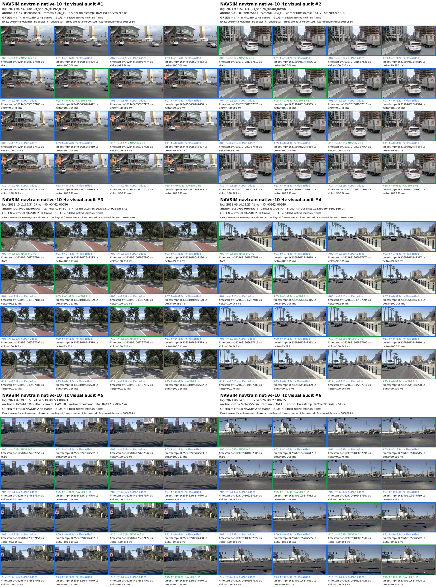

# navtrain_10hz_creation

Recreate **NAVSIM `navtrain` with native nuPlan v1.1 10 Hz camera
histories**. Official NAVSIM prediction anchors and labels remain at 2 Hz;
this project adds only the exact native camera frames between retained NAVSIM
observations.

This is a recreation tool, not a dataset mirror. It never commits or
redistributes raw NAVSIM/nuPlan data.



## What it creates

- 1,192 official `navtrain` logs and 103,288 existing NAVSIM anchors.
- 5,625,150 unique RGB camera images across eight 1920x1080 cameras.
- 1,219,960 trusted official NAVSIM/OpenScene frames reused in place.
- 4,405,190 added native nuPlan frames stored in 55 indexed `.pack` files.
- Exact source timestamps, including genuine capture gaps; no interpolation.
- A canonical history index, unified storage index, visual audit, and
  pack-backed loader.

It excludes test/mini data, maps, native LiDAR blobs, and unreferenced camera
images.

## Prerequisites

You must obtain and accept the official NAVSIM/OpenScene and nuPlan terms.
Prepare a NAVSIM root containing:

```text
<navsim-root>/
  navsim_logs/trainval/*.pkl
  sensor_blobs/trainval/<log>/CAM_*/<image>.jpg
```

Install Python 3.9+ and the locked dependencies:

```bash
python3 -m venv .venv
.venv/bin/pip install -r requirements.lock
```

## Direct JPEG download using published offsets

For native JPEG retrieval without remote TAR-header scanning, update this clone
and use the published 5,625,150-image offset index:

```bash
git pull --ff-only
.venv/bin/python scripts/navsim_direct_jpeg.py download \
  --manifest "file://$(pwd)/reference/direct_jpeg/latest.json" \
  --output /data/navtrain10hz-jpegs --workers 16 --limit 25
```

Remove `--limit 25` after checking the sample and available disk space. Repeat
the same command to resume with hash-verified receipts. If repository access
requires authentication, set `GITHUB_TOKEN` in the environment. For a Python
installation without a working trust store, add
`--ca-file /etc/ssl/certs/ca-certificates.crt`.

The [index release](https://github.com/LiuYMUNI/navtrain_10hz_creation/releases/tag/navsim-direct-jpeg-v1)
contains metadata only; JPEGs come from the original nuPlan source. This command
writes loose JPEGs beneath `sensor_blobs/`; it does not produce the `.pack`
files or final storage/history indexes used by the pipeline below. Each target
uses a direct byte-range request, with source ETag, size and JPEG validation,
plus native SHA-256 where recorded. Hashes of reused OpenScene images are not
claimed to be native nuPlan hashes. No measured full-run speedup is claimed.

## Fast single-machine workflow

The recommended local path uses the **same selective range packer as the
relay**. It does not download whole camera TAR objects, does not create
millions of loose new files, and does not run the older sequential staging
workflow. It processes up to 55 archives concurrently, reuses existing
NAVSIM frames, and writes directly to final packs.

```bash
cp configs/local.example.yaml configs/local.yaml
# Edit the two absolute roots.

.venv/bin/python scripts/run_navtrain10hz_local.py doctor \
  --config configs/local.yaml

.venv/bin/python scripts/run_navtrain10hz_local.py all \
  --config configs/local.yaml
```

The workflow is resumable. Individual stages can be resumed independently:

```bash
.venv/bin/python scripts/run_navtrain10hz_local.py plan --config configs/local.yaml
.venv/bin/python scripts/run_navtrain10hz_local.py pack --config configs/local.yaml
.venv/bin/python scripts/run_navtrain10hz_local.py finalize --config configs/local.yaml
.venv/bin/python scripts/run_navtrain10hz_local.py status --config configs/local.yaml
```

`pack_workers: 32` is the fast default for a well-connected machine. Speed is
ultimately bounded by upstream range-request latency and bandwidth; reduce it
only when the source or local link throttles requests. See
[docs/local_workflow.md](docs/local_workflow.md).

## Fast-network relay workflow

The relay uses the identical pack format and source checks. It only changes
where network retrieval happens.

1. Run `plan` on the destination.
2. Transfer this repository, the target-state SQLite file, and access to the
   official NAVSIM camera tree to the relay.
3. Run the generic 55-archive scheduler on the relay:

```bash
cp configs/relay-producer.example.yaml configs/relay-producer.yaml
.venv/bin/python scripts/run_navtrain10hz_relay.py \
  --config configs/relay-producer.yaml
```

4. Independently pull and verify completed packs from the destination:

```bash
.venv/bin/python scripts/offload_navsim_nuplan10hz_relay.py \
  --remote user@relay-host \
  --ssh-key /path/to/dedicated_key \
  --remote-root /scratch/navtrain10hz-relay \
  --local-pack-root /data/navtrain10hz-work/camera_packs \
  --local-state-root /data/navtrain10hz-work/relay_states \
  --local-report-root /data/navtrain10hz-work/relay_reports \
  --local-manifest-root /data/navtrain10hz-work/offload_manifests \
  --target-state-sqlite /data/navtrain10hz-work/state/camera_target_state.sqlite \
  --watch --threshold-gb 200 --relay-min-free-gb 500
```

The destination deletes a relay pack only after resumable rsync, full SHA-256
comparison, SQLite coverage validation, and durable local manifest creation.
Packing and deletion are independent processes. See
[docs/relay_workflow.md](docs/relay_workflow.md).

## Loader

`navtrain10hz.loader.Navsim10HzImageLoader` reads both trusted official files
and exact JPEG slices from packs. It checks SHA-256 before decoding and fails
closed on missing, conflicting, truncated, or unsafe storage.

The derived protocol does not modify stock NAVSIM labels, routes, evaluation,
or prediction-anchor frequency.

## Reproducibility and safety

- The pinned `reference/navtrain.yaml` SHA-256 is checked before production.
- Source archive sizes and ETags are pinned during range retrieval.
- Pack bytes are fsynced before SQLite offsets are committed.
- Every JPEG has size, marker, path, and SHA-256 validation.
- State is restart-safe and uncommitted pack tails are truncated on resume.
- Tests use synthetic fixtures and never require licensed data.
- Credentials, private keys, generated SQLite files, packs, and raw data are
  ignored by Git.

Run tests with:

```bash
.venv/bin/python -m unittest discover -s tests -v
```

More detail is available in [docs/lineage.md](docs/lineage.md).
